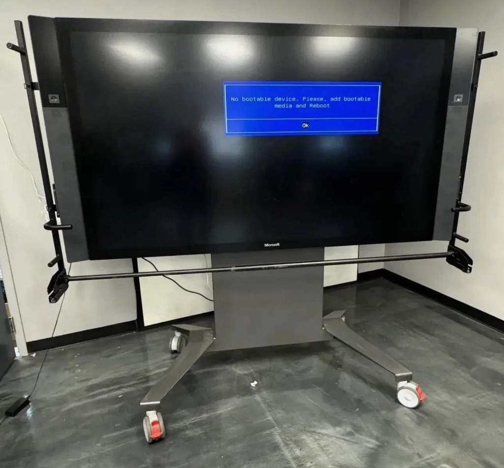
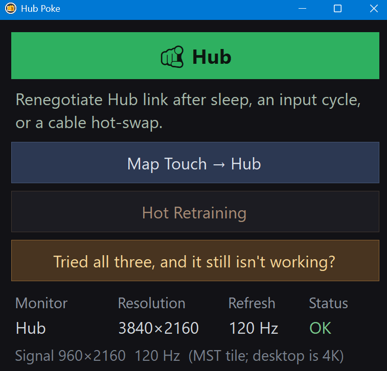
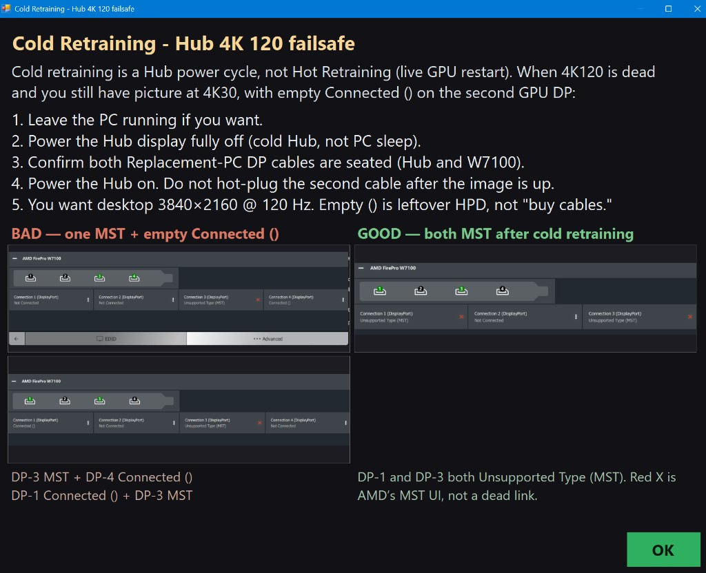

# Hub Poke

**Make your 2016 dumpster dive actually usable.**

You pulled a Surface Hub 84" out of a conference-room grave. You want a **dedicated PC** whose only job is that Hub — Replacement PC dual DisplayPort, not Guest, not a laptop, not a 2026 GPU “because 4K is 4K.”



*This is the unit. “No bootable device” is the original compute. You are not resurrecting Windows 10 Team. You hang a Replacement PC on the dual DP and make 4K120 actually stick.*

The payoff, when hardware **and** drivers are from the **same era**: a **120 Hz 4K 84-inch TOUCH** display.

## Who this is for

People running a Hub 84" as a **single-purpose** Windows machine on an old AMD workstation card (here: **FirePro W7100**, dual DP 1.2, Eyefinity/SLS). Microsoft’s 4K120 path was that stitch. New Adrenalin and Settings → Extend will not invent it.

Install Microsoft’s **[Surface Hub Replacement PC driver package](https://www.microsoft.com/download/details.aspx?id=52210)** on the PC. For the 84" at 120 Hz, use a listed-era card (this build: W7100) and the matching **Windows 10-era** AMD Pro/FirePro driver — **21.Q2.1** / **27.20.21026.2006** here, not current Adrenalin. That whole stack is Windows 10-era hardware and drivers. It runs on **Windows 11** just fine (Microsoft documents Replacement PC on Win10 *or* Win11). See [Connect and display with Surface Hub](https://learn.microsoft.com/en-us/surface-hub/connect-and-display-with-surface-hub).

Hub Poke is the tiny panel for **that** box. It is not a general AMD control panel, not an installer, and not a way to add a second desktop monitor.

## What a poke is

A **poke** is a gentle nudge: re-apply the known-good Hub desktop (**3840×2160 @ 120**) through Windows CCD. It does **not** restart the GPU.



Use it when the Hub is already the right kit, but the **link got stupid** after:

- sleep / resume
- cycling Hub inputs
- unplugging or reseating a DP cable

That is the green **Hub** button. Most days that is all you want.

The other buttons are not pokes:

| When | What |
| --- | --- |
| Taps land on the wrong screen after a mode change | **Map Touch → Hub** (USB/HID, not DisplayPort) |
| Gentle poke is not enough and you accept a live GPU restart | **Hot Retraining** (FirePro disable/enable; can TDR) |
| One GPU DP is MST Hub, the other is empty `Connected ()`, desktop stuck at 4K30 | **Tried all three…** → **Cold Retraining**: Hub **off**, both cables already in, Hub **on** |



## What it enables — and what it does not

**Enables:** keeping a known-good **era** Replacement-PC build on its feet: 4K120 desktop, card-side SLS (one Windows desktop), Hub touch on the 84".

**Does not:**

- Create 4K120 on a modern GPU or current Adrenalin
- Replace CCC Eyefinity / live SLS if the card never trained two tiles
- Fix a dead Hub DP jack or a missing second cable (one DP = **4K @ 30**, always)
- Make a **second monitor** a supported setup. We never got a stable dual-head build. We suspect overall system bandwidth and stability (possibly PCIe lanes). Windows really struggles when CPU onboard graphics drives an external monitor **and** a dedicated card is driving this Hub. Treat the Hub as the only display.

## Era kit (known-good here)

| Piece | This machine |
| --- | --- |
| Panel | Hub **84"** (`PPX0084`), **Replacement PC** dual DP |
| GPU | **FirePro W7100** (`VEN_1002` / `DEV_692B`) |
| Stitch | Card-side **SLS / Eyefinity** |
| Drivers | Microsoft **Replacement PC** package + AMD **21.Q2.1** / **27.20.21026.2006** (Win10-era; runs on Win11) |
| OS | Windows 11 |
| Cables | **Two** DP 1.2, seated **before** the Hub powers on |
| Touch | Hub HID `VID_2465` / `PID_6512` |

The MST *signal* may still read 960×2160@120. That is a tile, not the desktop. Never set the Windows desktop to 960.

## Things we learned to avoid

Match **era card + era driver**, then don’t:

- Skip the Microsoft Replacement PC drivers
- Buy a modern GPU for this job
- Put current Adrenalin on the W7100
- Settings → **Extend** (mixed iGPU + FirePro blacks the wrong screens)
- Drive a second monitor off the iGPU “on the side”
- Set the Hub desktop to 960
- PnP-disable the second Hub tile (UID265) — that locks **4K30**
- Hide 640×480 stubs in this app
- DDU / rip the iGPU as the first fix
- Live-restart the FirePro as the default poke
- Hot-plug the second DP after a 4K30 lock and expect 120 Hz
- Treat AMD’s red X + **Unsupported Type (MST)** as dead — two of those is the *healthy* look
- Treat empty `Connected ()` as “buy cables” — leftover HPD; Cold Retraining first
- Use software DPMS to wake the 84"
- Clone hoping it invents 4K120
- Blame Windows Update for eating the FirePro driver before you check the version

## Build (Windows)

```bat
build-button.cmd
```

Needs the .NET Framework 4.x `csc.exe` that ships with Windows. Keep `assets\` next to `HubButton.exe`.

This folder may also hold a private recovery lab (drivers, logs, one-off tools). Those are gitignored. Hub Poke finds the W7100 and Hub touch by hardware ID at runtime; it does not ship machine serials.
